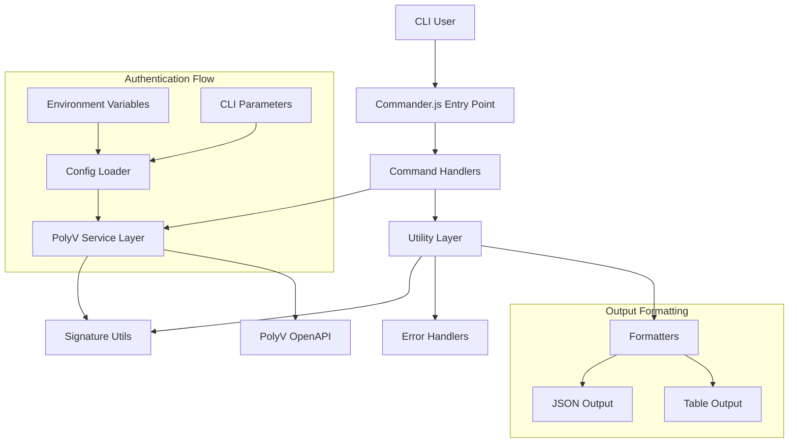
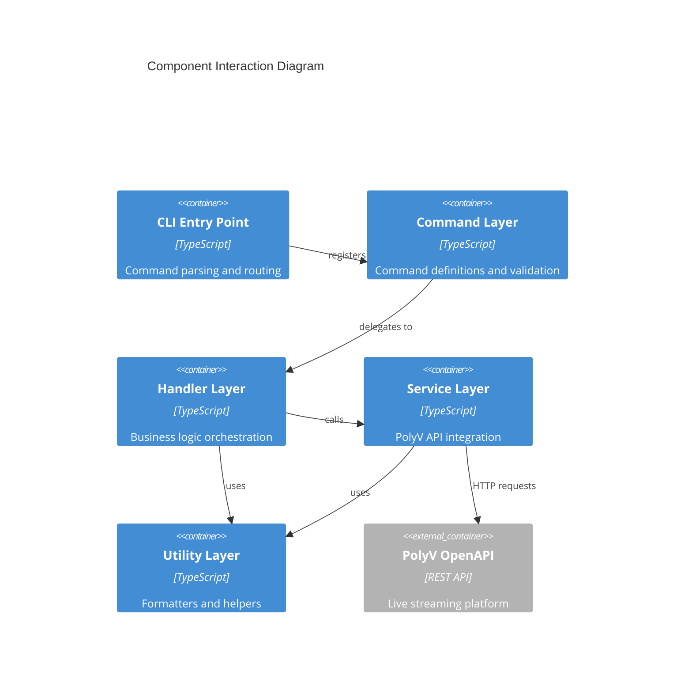
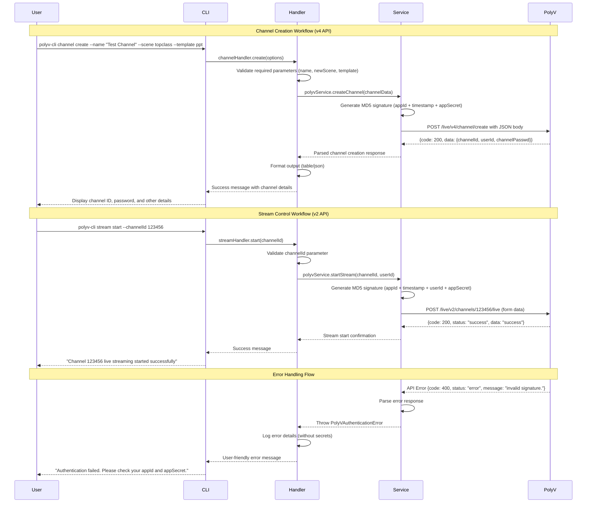
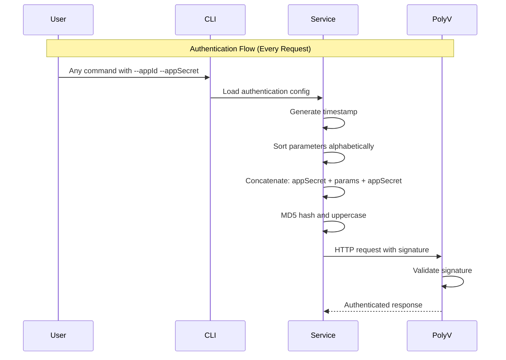

# PolyV Live Streaming CLI Tool Architecture Document

This document outlines the overall project architecture for the PolyV Live Streaming CLI Tool (保利威直播云CLI工具), including backend systems, shared services, and non-UI specific concerns. Its primary goal is to serve as the guiding architectural blueprint for AI-driven development, ensuring consistency and adherence to chosen patterns and technologies.

**Relationship to Frontend Architecture:**
This is a CLI-only project with no user interface components. All user interaction occurs through command-line interfaces.

### Starter Template or Existing Project

**Decision:** This is a greenfield TypeScript/Node.js CLI project. No existing starter template will be used to maintain full control over the architecture and ensure it aligns perfectly with PolyV API requirements and team expertise.

### Change Log

| Date | Version | Description | Author |
| :--- | :------ | :---------- | :----- |
| 2026-03-22 | 2.0 | Extended for Epic 9-14 (29 new modules) | Technical Architect |
| 2025-07-01 | 1.1 | Updated to follow standard architecture template | Technical Architect |
| 2025-07-01 | 1.0 | Initial architecture document | Technical Architect |

## High Level Architecture

### Technical Summary

The PolyV CLI tool employs a classic layered architecture pattern built on TypeScript/Node.js. The system features a presentation layer powered by Commander.js for command parsing, a business logic layer for core operations, a service layer for PolyV API integration with MD5 signature authentication, and a utility layer for common functionality. This architecture prioritizes simplicity, rapid iteration, and extensibility while ensuring fault tolerance for network operations and API failures.

### High Level Overview

**Architectural Style:** Layered Architecture (4-tier)
- Clean separation of concerns across presentation, business logic, service, and utility layers
- Command-driven interaction model suitable for CLI operations
- Stateless design with external authentication per request

**Repository Structure:** Monorepo approach with TypeScript source in `src/` and compiled output in `dist/`

**Service Architecture:** Monolithic CLI application with modular command structure

**Primary User Flow:**
1. User invokes CLI command with authentication parameters
2. Commander.js parses command and delegates to appropriate handler
3. Handler processes business logic and calls PolyV service
4. Service layer handles API authentication, signature generation, and HTTP requests
5. Response is formatted and displayed to user via utility formatters

**Key Architectural Decisions:**
- **TypeScript over JavaScript:** Ensures type safety and better maintainability
- **Commander.js over alternatives:** Most stable and widely-adopted CLI framework
- **Layered over modular:** Simpler to understand and maintain for CLI use case
- **MD5 signature authentication:** Required by PolyV API specification

### High Level Project Diagram



### Architectural and Design Patterns

- **Layered Architecture:** Clean separation between presentation, business logic, service, and utility concerns - _Rationale:_ Provides clear boundaries, enables independent testing, and supports future extensibility
- **Command Pattern:** Each CLI command encapsulates its execution logic - _Rationale:_ Enables easy addition of new commands and consistent command structure
- **Service Layer Pattern:** Centralized PolyV API interaction through dedicated service class - _Rationale:_ Abstracts API complexity and enables consistent error handling and authentication
- **Strategy Pattern:** Pluggable output formatters (table vs JSON) - _Rationale:_ Supports both human-readable and machine-parseable output formats
- **Factory Pattern:** Error creation and formatting utilities - _Rationale:_ Ensures consistent error messages and handling across the application

## Tech Stack

### Cloud Infrastructure

- **Provider:** Not applicable (CLI tool runs locally)
- **Key Services:** PolyV OpenAPI (external service)
- **Deployment Regions:** Global distribution via npm registry

### Technology Stack Table

| Category           | Technology         | Version     | Purpose     | Rationale      |
| :----------------- | :----------------- | :---------- | :---------- | :------------- |
| **Language**       | TypeScript         | 5.3.3       | Primary development language | Strong typing, excellent tooling, team expertise, better maintainability |
| **Runtime**        | Node.js            | 20.11.0 LTS | JavaScript runtime | LTS stability, wide ecosystem, async I/O perfect for CLI operations |
| **CLI Framework**  | Commander.js       | 11.1.0      | Command parsing and routing | Most stable and popular CLI framework, simple API, comprehensive features |
| **HTTP Client**    | Axios              | 1.6.0       | PolyV API communication | Feature-rich, Promise-based, built-in interceptors for auth and errors |
| **Configuration**  | dotenv             | 16.3.1      | Environment variable loading | Standard for Node.js env var management |
| **Table Output**   | cli-table3         | 0.6.3       | Formatted console output | Rich text table formatting with customizable styles |
| **Testing**        | Jest               | 29.7.0      | Unit and integration testing | Comprehensive testing framework with TypeScript support |
| **Build Tool**     | TypeScript Compiler| 5.3.3      | Source compilation | Native TypeScript compilation, no additional bundling needed |
| **Package Manager**| npm                | 10.2.0      | Dependency and distribution | Standard Node.js package manager, global CLI installation support |
| **Linting**        | ESLint             | 8.55.0      | Code quality and style | Industry standard linting with TypeScript support |
| **Formatting**     | Prettier           | 3.1.0       | Code formatting | Consistent code style across team |

## Data Models

### ChannelModel

**Purpose:** Represents a live streaming channel with its configuration and state

**Key Attributes:**

- `channelId: string` - Unique channel identifier from PolyV API
- `name: string` - Human-readable channel name (max 100 characters)
- `scene: string` - Legacy live scene (alone/topclass/ppt/seminar)
- `newScene: string` - New live scene (topclass/double/train/alone/seminar/guide)
- `template: string` - Live template (ppt/portrait_ppt/alone/portrait_alone/topclass/portrait_topclass/seminar)
- `channelPasswd: string` - Instructor password (6-16 characters)
- `publisher: string` - Host/presenter name
- `startTime: number` - Live start time (13-digit timestamp)
- `endTime: number` - Live end time (13-digit timestamp)
- `pageView: number` - Cumulative view count
- `likes: number` - Like count
- `coverImg?: string` - Channel icon URL
- `splashImg?: string` - Splash page image URL
- `splashEnabled: 'Y' | 'N'` - Splash page switch
- `desc?: string` - Live description
- `consultingMenuEnabled: 'Y' | 'N'` - Consultation menu switch
- `maxViewerRestrict: 'Y' | 'N'` - Max viewer restriction switch
- `maxViewer: number` - Maximum concurrent viewers
- `watchStatus: 'live' | 'playback' | 'end' | 'waiting' | 'unStart' | 'banpush'` - Watch page status
- `watchStatusText: string` - Watch status description
- `pureRtcEnabled: 'Y' | 'N'` - Low latency mode switch
- `linkMicLimit: number` - Mic connection limit
- `createdTime: number` - Creation time (13-digit timestamp)
- `pushUrl?: string` - Push stream URL (pure video only)
- `pushSecret?: string` - Push stream key (pure video only)
- `streamType: 'client' | 'disk'` - Live streaming method

**Relationships:**

- Associated with PolyV user account via authentication
- Belongs to a category (userCategory)
- Has viewing conditions (authSettings)
- Has labels (labelData)

### AuthenticationModel

**Purpose:** Encapsulates PolyV API authentication parameters and signature generation

**Key Attributes:**

- `appId: string` - PolyV application identifier
- `appSecret: string` - PolyV application secret (never logged)
- `userId?: string` - POLYV user ID (required for stream control operations)
- `timestamp: number` - Request timestamp in 13-digit milliseconds (3-minute validity)
- `sign: string` - Generated MD5 signature (32-character uppercase)

**Relationships:**

- Used by all API requests to PolyV services
- Generated fresh for each request to ensure security
- URL parameters (appId, timestamp, sign) participate in signature
- Request body parameters do NOT participate in signature generation

### ApiResponseModel

**Purpose:** Standardized wrapper for all PolyV API responses

**Key Attributes:**

- `code: number` - HTTP status code (200 for success, 400/500 for errors)
- `status: 'success' | 'error'` - Response status text
- `message?: string` - Error description when code is 400/500
- `data: T` - Generic response payload (varies by endpoint)
- `success?: boolean` - Success flag (v4 APIs only)
- `requestId?: string` - Unique request identifier for debugging (v4 APIs only)
- `error?: object` - Error object with code and desc (v4 APIs only)

**Relationships:**

- Base type for all service layer responses
- Consumed by handlers for business logic processing

### StreamInfoModel

**Purpose:** Represents real-time streaming information for a live channel

**Key Attributes:**

- `deployAddress?: string` - CDN node IP address for push stream
- `inAddress?: string` - Push stream exit IP address
- `streamName: string` - Stream name identifier
- `fps: string` - Push stream frame rate
- `lfr?: string` - Push stream frame loss rate
- `inBandWidth: string` - Push stream bitrate in bps

**Relationships:**

- Associated with a specific channel during live streaming
- Only available when channel is in live status

### ChannelListModel

**Purpose:** Represents the response from channel listing operations

**Key Attributes:**

- `channels: string[]` - Array of channel IDs matching the search criteria

**Relationships:**

- Result of channel list/search operations
- Channel IDs can be used to fetch detailed channel information

## Components

### CLI Entry Point (`src/index.ts`)

**Responsibility:** Application bootstrap, command registration, and global error handling

**Key Interfaces:**

- Commander.js program configuration
- Global option parsing (--help, --version)
- Unhandled exception catching

**Dependencies:** Commander.js, all command modules

**Technology Stack:** TypeScript, Commander.js, Node.js process handling

### Command Layer (`src/commands/`)

**Responsibility:** Command definition, parameter validation, and handler delegation

**Key Interfaces:**

- `ChannelCommands`: channel create/list/get/update/delete
- `StreamCommands`: stream get-key/start/stop
- Command-specific option and argument parsing

**Dependencies:** Commander.js, handler layer

**Technology Stack:** Commander.js command definitions, TypeScript interfaces

### Handler Layer (`src/handlers/`)

**Responsibility:** Business logic orchestration and response formatting

**Key Interfaces:**

- `ChannelHandler`: Channel lifecycle management logic
- `StreamHandler`: Stream control operations
- Input validation and business rule enforcement

**Dependencies:** Service layer, utility formatters, error handlers

**Technology Stack:** TypeScript business logic, async/await patterns

### Service Layer (`src/services/`)

**Responsibility:** PolyV API integration, authentication, and HTTP communication

**Key Interfaces:**

- `PolyVService`: Main API client with authentication
- RESTful API method wrappers
- Request/response transformation

**Dependencies:** Axios, authentication utilities, configuration

**Technology Stack:** Axios HTTP client, MD5 signature generation, TypeScript

### Utility Layer (`src/utils/`)

**Responsibility:** Cross-cutting concerns like formatting, errors, and authentication

**Key Interfaces:**

- `Formatter`: Table and JSON output formatting
- `ErrorHandler`: Consistent error processing and user messages
- `SignatureHelper`: PolyV MD5 signature generation

**Dependencies:** cli-table3, crypto (Node.js built-in)

**Technology Stack:** cli-table3, Node.js crypto, TypeScript utilities

### Component Diagrams



## External APIs

### PolyV OpenAPI

- **Purpose:** Live streaming channel and stream management operations
- **Documentation:** PolyV developer documentation (internal)
- **Base URL(s):** `http://api.polyv.net/live/` (multiple API versions: v2, v3, v4)
- **Authentication:** MD5 signature with appId/appSecret/userId
- **Rate Limits:** Frequency limits apply, 3-minute timestamp validity

**Key Endpoints Used:**

- `POST /live/v4/channel/create` - Create new live streaming channels
- `GET /live/v3/user/channels` - List existing channels with filtering
- `GET /live/v4/channel/basic/get` - Get detailed channel information
- `POST /live/v3/channel/basic/update` - Update channel configuration
- `POST /live/v3/channel/basic/batch-delete` - Batch delete channels
- `GET /live/v3/channel/monitor/get-stream-info` - Get streaming URLs and keys
- `POST /live/v2/channels/{channelId}/live` - Start live streaming
- `POST /live/v2/channels/{channelId}/end` - Stop live streaming

**Integration Notes:** 
- All requests require MD5 signature authentication with appId, timestamp, and sign
- userId parameter required for some endpoints (stream control)
- Timestamps must be 13-digit millisecond timestamps, valid for 3 minutes
- Empty/null parameters must be filtered from signature calculation
- Request body parameters do not participate in signature generation
- Content-Type: application/json required for POST requests with JSON body
- Retry logic implemented for network failures
- HTTPS strongly recommended for security

## Core Workflows





## REST API Spec

This CLI tool consumes the PolyV OpenAPI but does not expose its own REST API. The tool acts as a client to the following PolyV endpoints:

```yaml
# PolyV API Integration Specification
# Note: This is the consumed API, not an exposed API

channels:
  create:
    method: POST
    path: /live/v4/channel/create
    auth: MD5 signature required (appId, timestamp, sign in URL)
    content_type: application/json
    body_parameters:
      - name: string (required) - Channel name, max 100 characters
      - newScene: string (required) - Live scene (topclass/double/train/alone/seminar/guide)
      - template: string (required) - Live template (ppt/portrait_ppt/alone/portrait_alone/topclass/portrait_topclass/seminar)
      - channelPasswd: string (optional) - Instructor password, 6-16 characters
      - seminarHostPassword: string (optional) - Seminar host password
      - seminarAttendeePassword: string (optional) - Seminar attendee password
      - pureRtcEnabled: string (optional) - Low latency mode (Y/N)
      - type: string (optional) - Broadcast type (normal/transmit/receive)
      - linkMicLimit: integer (optional) - Mic connection limit, max 16
      - categoryId: integer (optional) - Category ID
      - startTime: long (optional) - Start time timestamp
      - endTime: long (optional) - End time timestamp
      - labelData: array (optional) - Tag ID array
  
  list:
    method: GET
    path: /live/v3/user/channels
    auth: MD5 signature required
    parameters:
      - categoryId: string (optional) - Category ID filter
      - keyword: string (optional) - Channel name fuzzy search
      - labelId: string (optional) - Label ID filter
  
  get:
    method: GET
    path: /live/v4/channel/basic/get
    auth: MD5 signature required
    parameters:
      - channelId: string (required) - Channel ID
    
  update:
    method: POST
    path: /live/v3/channel/basic/update
    auth: MD5 signature required (channelId, timestamp, appId in URL)
    content_type: application/json
    body_parameters:
      - basicSetting: object (optional) - Basic channel settings
      - authSettings: array (optional) - Viewing condition settings
    
  batchDelete:
    method: POST
    path: /live/v3/channel/basic/batch-delete
    auth: MD5 signature required
    content_type: application/json
    body_parameters:
      - channelIds: array[string] (required) - Channel ID list, max 100 channels

streams:
  getStreamInfo:
    method: GET
    path: /live/v3/channel/monitor/get-stream-info
    auth: MD5 signature required
    parameters:
      - channelId: string (required) - Channel ID (must be live)
    
  start:
    method: POST
    path: /live/v2/channels/{channelId}/live
    auth: MD5 signature required
    content_type: application/x-www-form-urlencoded
    parameters:
      - userId: string (required) - POLYV user ID
    
  stop:
    method: POST
    path: /live/v2/channels/{channelId}/end
    auth: MD5 signature required
    content_type: application/x-www-form-urlencoded
    parameters:
      - userId: string (required) - POLYV user ID
```

## Database Schema

This CLI tool does not maintain its own database. All data is stored and managed by the PolyV platform via API calls. The tool operates in a stateless manner, fetching fresh data from PolyV APIs for each operation.

**Data Flow:**
- Configuration: Loaded from environment variables or CLI parameters
- Channel Data: Retrieved from PolyV API in real-time
- Authentication: Generated fresh for each request
- Output: Formatted and displayed immediately, not persisted

## Source Tree

```plaintext
polyv-cli/
├── .github/                    # CI/CD workflows
│   └── workflows/
│       └── release.yml         # Automated testing and npm publishing
├── .vscode/                    # VSCode settings (optional)
│   └── settings.json
├── dist/                       # Compiled TypeScript output (git-ignored)
├── docs/                       # Project documentation
│   ├── prd/                    # Product requirements
│   ├── architecture/           # Architecture documentation
│   └── stories/                # User stories
├── coverage/                   # Test coverage reports (git-ignored)
├── node_modules/               # Dependencies (git-ignored)
├── src/                        # TypeScript source code
│   ├── commands/               # Command definitions
│   │   ├── channel.ts          # Channel management commands
│   │   └── stream.ts           # Stream control commands
│   ├── handlers/               # Business logic handlers
│   │   ├── channelHandler.ts   # Channel operations logic
│   │   └── streamHandler.ts    # Stream operations logic
│   ├── services/               # External service integration
│   │   └── polyvService.ts     # PolyV API client
│   ├── config/                 # Configuration management
│   │   ├── auth.ts             # Authentication configuration
│   │   ├── loader.ts           # Configuration loading
│   │   ├── manager.ts          # Configuration management
│   │   └── validator.ts        # Configuration validation
│   ├── types/                  # TypeScript type definitions
│   │   ├── auth.ts             # Authentication types
│   │   ├── config.ts           # Configuration types
│   │   ├── index.ts            # Exported types
│   │   └── signature.ts        # Signature types
│   ├── utils/                  # Utility functions
│   │   ├── errors.ts           # Error handling utilities
│   │   ├── formatter.ts        # Output formatting
│   │   └── signature.ts        # MD5 signature generation
│   └── index.ts                # Main CLI entry point
├── tests/                      # Test files
│   ├── auth/                   # Authentication tests
│   ├── cli-setup/              # Basic CLI functionality tests
│   ├── config/                 # Configuration tests
│   ├── index-coverage.spec.ts  # Coverage tests
│   └── index-integration.spec.ts # Integration tests
├── .env.example                # Environment variables template
├── .gitignore                  # Git ignore rules
├── package.json                # NPM package configuration
├── package-lock.json           # Dependency lock file
├── tsconfig.json               # TypeScript configuration
├── jest.config.js              # Jest testing configuration
├── .eslintrc.js                # ESLint configuration
├── .prettierrc                 # Prettier configuration
└── README.md                   # Project documentation
```

## Infrastructure and Deployment

### Infrastructure as Code

- **Tool:** Not applicable (CLI tool distributed via npm)
- **Location:** N/A
- **Approach:** Package-based distribution through npm registry

### Deployment Strategy

- **Strategy:** Automated npm publishing on git tag creation
- **CI/CD Platform:** GitHub Actions
- **Pipeline Configuration:** `.github/workflows/release.yml`

### Environments

- **Development:** Local development with `npm run dev`
- **Testing:** CI environment with automated test execution
- **Production:** Published npm package available globally

### Environment Promotion Flow

```text
Local Development → GitHub Push → CI Testing → Git Tag → NPM Publishing → Global Distribution
```

### Rollback Strategy

- **Primary Method:** npm version management and deprecation
- **Trigger Conditions:** Critical bugs, security vulnerabilities, API compatibility issues
- **Recovery Time Objective:** < 1 hour for critical issues

## Error Handling Strategy

### General Approach

- **Error Model:** Structured error objects with user-friendly messages
- **Exception Hierarchy:** Base PolyVError with specific subtypes (AuthError, NetworkError, ValidationError)
- **Error Propagation:** Catch at service layer, transform to user-friendly messages at handler layer

### Logging Standards

- **Library:** Console (Node.js built-in) with structured formatting
- **Format:** Structured JSON for debugging, human-readable for user output
- **Levels:** ERROR (user-facing), DEBUG (development only)
- **Required Context:**
  - Command executed
  - Authentication method used (but never secrets)
  - API endpoint called
  - Error type and message

### Error Handling Patterns

#### External API Errors

- **Retry Policy:** 3 attempts with exponential backoff for network errors (5xx status codes)
- **Circuit Breaker:** Not implemented (single-user CLI tool)
- **Timeout Configuration:** 30 seconds for API requests
- **Error Translation:** PolyV error codes mapped to user-friendly messages
- **Common PolyV Errors:**
  - `code: 400, message: "invalid signature."` → Authentication failure
  - `code: 400, message: "时间戳过期"` → Timestamp expired (>3 minutes)
  - `code: 400, error: {code: 20001, desc: "application not found."}` → Invalid appId
  - `code: 400, error: {code: 10003, desc: "时间戳过期"}` → Timestamp validation failed

#### Business Logic Errors

- **Custom Exceptions:** PolyVError, PolyVAuthenticationError, PolyVValidationError, PolyVNetworkError
- **User-Facing Errors:** Clear, actionable messages with suggested solutions
- **Error Codes:** Aligned with PolyV API error codes where applicable
- **Validation Errors:**
  - Missing required parameters (name, newScene, template for channel creation)
  - Invalid parameter formats (channelId must be numeric string)
  - Channel not found or access denied
  - Channel not in correct state for operation (e.g., must be live for stream info)

#### Data Consistency

- **Transaction Strategy:** Not applicable (stateless CLI)
- **Compensation Logic:** Not applicable (no local state)
- **Idempotency:** Handled by PolyV API, CLI warns on potentially duplicate operations

## Coding Standards

### Core Standards

- **Languages & Runtimes:** TypeScript 5.3.3, Node.js 20.11.0 LTS
- **Style & Linting:** ESLint + Prettier with TypeScript-specific rules
- **Test Organization:** Jest with `.test.ts` suffix, co-located with source files

### Naming Conventions

| Element   | Convention           | Example           |
| :-------- | :------------------- | :---------------- |
| Variables | camelCase            | `channelId`       |
| Functions | camelCase            | `createChannel`   |
| Classes   | PascalCase           | `PolyVService`    |
| Files     | kebab-case           | `channel-handler.ts` |
| Types     | PascalCase           | `ChannelModel`    |

### Critical Rules

- **Never log secrets:** Use redacted logging for authentication parameters
- **Always validate input:** All user inputs must be validated before API calls
- **Use structured errors:** All errors must extend base PolyVError class
- **Async/await only:** No Promise.then() chains, use async/await consistently
- **Type everything:** No `any` types except for external API responses (which must be validated)

## Test Strategy and Standards

### Testing Philosophy

- **Approach:** Test-driven development with comprehensive coverage
- **Coverage Goals:** 80% minimum, 90% target for critical paths
- **Test Pyramid:** 70% unit tests, 20% integration tests, 10% end-to-end CLI tests

### Test Types and Organization

#### Unit Tests

- **Framework:** Jest 29.7.0
- **File Convention:** `*.test.ts` co-located with source files
- **Location:** Adjacent to source files in `src/` directory
- **Mocking Library:** Jest built-in mocking
- **Coverage Requirement:** 80% minimum

**AI Agent Requirements:**

- Generate tests for all public methods and exported functions
- Mock all external dependencies (PolyV API, file system)
- Test both success and error scenarios
- Follow AAA pattern (Arrange, Act, Assert)

#### Integration Tests

- **Scope:** Command-to-service integration, configuration loading, authentication flow
- **Location:** `tests/` directory organized by feature
- **Test Infrastructure:**
  - **PolyV API:** Mock server using nock for HTTP interception
  - **File System:** Temporary directories for configuration testing
  - **Environment:** Isolated test environment variables

#### End-to-End Tests

- **Framework:** Jest with child_process for CLI execution
- **Scope:** Full CLI command execution with mocked external dependencies
- **Environment:** Isolated test environment with temporary configuration
- **Test Data:** Predefined test scenarios with known inputs/outputs

### Test Data Management

- **Strategy:** Factory functions for test data generation
- **Fixtures:** JSON files for complex API response mocking
- **Factories:** TypeScript factories for model generation
- **Cleanup:** Automatic cleanup of temporary files and mock state

### Continuous Testing

- **CI Integration:** GitHub Actions with matrix testing across Node.js versions
- **Performance Tests:** Not applicable for CLI tool
- **Security Tests:** Dependency vulnerability scanning with npm audit

## Security

### Input Validation

- **Validation Library:** Built-in TypeScript type checking + custom validators
- **Validation Location:** Command layer before handler delegation
- **Required Rules:**
  - All CLI arguments must be validated against expected types
  - Channel IDs must match expected format patterns
  - File paths (if any) must be within allowed directories

### Authentication & Authorization

- **Auth Method:** PolyV MD5 signature authentication per request
- **Session Management:** Stateless - no session management required
- **Required Patterns:**
  - Never log appSecret or any derived signatures
  - Validate authentication parameters before signature generation
  - Clear sensitive data from memory after use

### Secrets Management

- **Development:** Environment variables in `.env` file (gitignored)
- **Production:** User-provided environment variables or CLI parameters
- **Code Requirements:**
  - NEVER hardcode secrets in source code
  - Always use environment variables or CLI parameters
  - No secrets in logs, error messages, or debug output

### API Security

- **Rate Limiting:** Respect PolyV API rate limits (implementation TBD based on API docs)
- **CORS Policy:** Not applicable (CLI tool, not web application)
- **Security Headers:** Not applicable (no HTTP server)
- **HTTPS Enforcement:** All PolyV API calls use HTTPS

### Data Protection

- **Encryption at Rest:** Not applicable (no local data storage)
- **Encryption in Transit:** HTTPS for all API communications
- **PII Handling:** No PII stored locally, all data handled via PolyV API
- **Logging Restrictions:** Never log authentication secrets, user passwords, or sensitive channel data

### Dependency Security

- **Scanning Tool:** npm audit (built into npm)
- **Update Policy:** Monthly dependency updates, immediate security patches
- **Approval Process:** All new dependencies must be approved and security-scanned

### Security Testing

- **SAST Tool:** ESLint security rules
- **DAST Tool:** Not applicable (no web interface)
- **Penetration Testing:** Not required for CLI tool

## Next Steps

### Developer Handoff

**Prompt for Development Team:**

```
Begin implementation of the PolyV CLI tool using this architecture document as the definitive guide. 

Key implementation priorities:
1. Start with Epic 1.1 (Project Setup and Basic CLI Structure) 
2. Follow the exact tech stack specified: TypeScript 5.3.3, Node.js 20.11.0 LTS, Commander.js 11.1.0
3. Implement the layered architecture exactly as documented
4. Use the coding standards and error handling patterns specified
5. Ensure all authentication follows the MD5 signature mechanism detailed in the architecture

Reference documents:
- This architecture document for technical decisions
- docs/prd.md (or或 `_bmad-output/planning-artifacts/prd.md`) for functional requirements
- docs/stories/*.story.md for implementation tasks

The architecture is complete and ready for implementation. No frontend architecture is needed as this is a CLI-only tool.

---

## Extension Architecture forEpic 9-14

### Architecture Analysis

The existing layered architecture (CLI → Handler → Service → API) fully supports Epic 9-14. However, the architecture document needs to be updated to include:

1. **New SDK Services** for 29 new modules:
   - PlaybackService, StatisticsService, ChatService,   - InteractionService, ViewerService, DocumentService,
   - SessionService, RecordService, PlayerService, CallbackService,
   - And 20+ more services

2. **New Type Definitions** for each new module

3. **API Client Extensions** in PolyVClient

### Recommended Updates

| Section | Status | Action |
|--------|------|--------|
| Tech Stack | ✅ No change | Existing stack supports all modules |
| Architecture Overview | ✅ No change | Layered architecture supports all |
| Data Models | ⚠️ Extend | Add models for 29 new modules |
| Service Layer | ⚠️ Extend | Add service classes for 29 new modules |
| API Client | ⚠️ Extend | Add API methods to PolyVClient |
| Test Strategy | ✅ No change | Same testing patterns apply |

### Decision Required

**Does the architecture document need a full update?**

- **Option A: Full Update** - Create a new architecture document covering Epic 9-14
- **Option B: Minimal Update** - Add an "Extension Architecture" section to the existing document
- **Option C: Skip** - Architecture is sufficiently flexible, proceed with implementation

---

*Architecture document complete. Ready for development team handoff and implementation of Epic 1.1.*