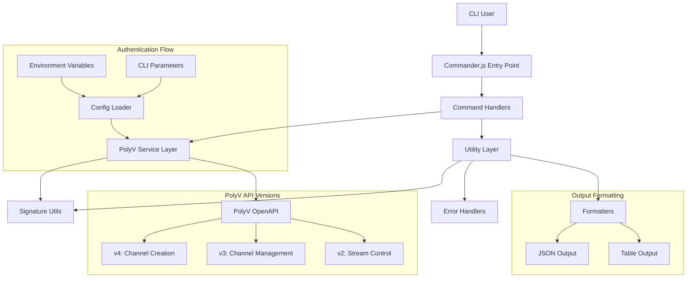

# High-Level Architecture

**Version**: 1.2  
**Last Updated**: 2025-07-01  
**Related**: [Main Architecture](../architecture.md)

---

## Technical Summary

The PolyV CLI tool employs a **classic layered architecture pattern** built on TypeScript/Node.js. The system features a presentation layer powered by Commander.js for command parsing, a business logic layer for core operations, a service layer for PolyV API integration with MD5 signature authentication, and a utility layer for common functionality. 

This architecture prioritizes **simplicity, rapid iteration, and extensibility** while ensuring fault tolerance for network operations and API failures.

---

## Architectural Style

### **Layered Architecture (4-tier)**

```
┌─────────────────────────────────────────┐
│           CLI User Interface            │
└─────────────────────────────────────────┘
                    │
┌─────────────────────────────────────────┐
│         Presentation Layer              │
│    (Commander.js Command Parsing)      │
│  • src/index.ts                        │
│  • src/commands/                       │
└─────────────────────────────────────────┘
                    │
┌─────────────────────────────────────────┐
│         Business Logic Layer           │
│     (Handler Orchestration)            │
│  • src/handlers/                       │
└─────────────────────────────────────────┘
                    │
┌─────────────────────────────────────────┐
│         Service Layer                   │
│      (PolyV API Integration)            │
│  • src/services/                       │
│  • src/config/                         │
└─────────────────────────────────────────┘
                    │
┌─────────────────────────────────────────┐
│         Utility Layer                   │
│    (Cross-cutting Concerns)            │
│  • src/utils/                          │
│  • src/types/                          │
└─────────────────────────────────────────┘
```

### **Key Characteristics**
- **Clean separation of concerns** across layers
- **Command-driven interaction** model suitable for CLI operations
- **Stateless design** with external authentication per request
- **Monolithic CLI application** with modular command structure

---

## High-Level System Diagram



---

## Primary User Flow

### **Standard Command Execution**

1. **User invokes CLI command** with authentication parameters
2. **Commander.js parses command** and delegates to appropriate handler
3. **Handler processes business logic** and calls PolyV service
4. **Service layer handles API authentication**, signature generation, and HTTP requests
5. **Response is formatted and displayed** to user via utility formatters

### **Authentication Flow (Every Request)**

```
User Input → Config Loader → Signature Generator → API Request → Response Parser → User Output
```

---

## Architectural Decisions

### **Core Technology Choices**

| Decision | Rationale |
|----------|-----------|
| **TypeScript over JavaScript** | Ensures type safety and better maintainability |
| **Commander.js over alternatives** | Most stable and widely-adopted CLI framework |
| **Layered over modular** | Simpler to understand and maintain for CLI use case |
| **MD5 signature authentication** | Required by PolyV API specification |
| **Axios over fetch** | Rich feature set with interceptors and error handling |
| **Stateless design** | Simplifies CLI operations and reduces complexity |

### **Repository Structure**
- **Monorepo approach** with TypeScript source in `src/` and compiled output in `dist/`
- **Clear separation** between source code, tests, documentation, and build artifacts
- **npm-based distribution** for global CLI installation

---

## Design Patterns

### **Layered Architecture Pattern**
- **Rationale**: Provides clear boundaries, enables independent testing, and supports future extensibility
- **Implementation**: Each layer only communicates with adjacent layers
- **Benefits**: Maintainable, testable, and scalable architecture

### **Command Pattern**
- **Rationale**: Enables easy addition of new commands and consistent command structure
- **Implementation**: Each CLI command encapsulates its execution logic
- **Benefits**: Extensible command system with uniform interface

### **Service Layer Pattern**
- **Rationale**: Abstracts API complexity and enables consistent error handling and authentication
- **Implementation**: Centralized PolyV API interaction through dedicated service class
- **Benefits**: Single point of API integration with reusable authentication

### **Strategy Pattern**
- **Rationale**: Supports both human-readable and machine-parseable output formats
- **Implementation**: Pluggable output formatters (table vs JSON)
- **Benefits**: Flexible output formatting for different use cases

### **Factory Pattern**
- **Rationale**: Ensures consistent error messages and handling across the application
- **Implementation**: Error creation and formatting utilities
- **Benefits**: Standardized error handling and user messaging

---

## Quality Attributes

### **Performance**
- **Target**: Single command execution under 200ms (excluding network latency)
- **Approach**: Efficient TypeScript compilation and minimal dependency loading
- **Monitoring**: Performance testing in CI/CD pipeline

### **Reliability**
- **Target**: Graceful handling of API failures and network issues
- **Approach**: Retry logic, timeout configuration, and structured error handling
- **Monitoring**: Error rate tracking and user feedback collection

### **Maintainability**
- **Target**: Easy addition of new commands and API endpoints
- **Approach**: Clear layer separation and consistent coding standards
- **Monitoring**: Code review process and automated linting

### **Usability**
- **Target**: Intuitive CLI interface with helpful error messages
- **Approach**: Commander.js help system and user-friendly error formatting
- **Monitoring**: User feedback and GitHub issue tracking

### **Security**
- **Target**: Secure handling of API credentials and signatures
- **Approach**: Environment variable management and signature validation
- **Monitoring**: Security audit and dependency scanning

---

## Scalability Considerations

### **Command Extensibility**
- **Pattern**: New commands follow established handler → service → API pattern
- **Configuration**: Centralized command registration in main entry point
- **Testing**: Consistent test patterns for all command types

### **API Version Management**
- **Strategy**: Service layer abstracts API version differences
- **Implementation**: Version-specific endpoint handling within service methods
- **Migration**: Gradual migration to newer API versions as available

### **Error Handling Evolution**
- **Pattern**: Centralized error type definitions with extensible hierarchy
- **Localization**: Support for multiple languages in error messages
- **Monitoring**: Structured logging for error pattern analysis

---

## Integration Points

### **External Dependencies**
- **PolyV OpenAPI**: Primary integration point for all live streaming operations
- **npm Registry**: Distribution and dependency management
- **GitHub Actions**: CI/CD pipeline integration

### **Internal Interfaces**
- **Command → Handler**: Standardized option and argument passing
- **Handler → Service**: Typed method calls with error propagation
- **Service → Utility**: Shared authentication and formatting functions

---

## Future Architecture Evolution

### **Planned Enhancements**
- **Plugin System**: Support for third-party command extensions
- **Configuration Management**: Enhanced config file support
- **Caching Layer**: Local caching for frequently accessed data
- **Async Operations**: Background task support for long-running operations

### **Migration Strategies**
- **API Versioning**: Graceful migration to newer PolyV API versions
- **Breaking Changes**: Semantic versioning with migration guides
- **Deprecation Policy**: Clear timeline for removing legacy features

---

*This high-level architecture provides the foundation for all implementation decisions. Refer to specific module documents for detailed implementation guidance.* 